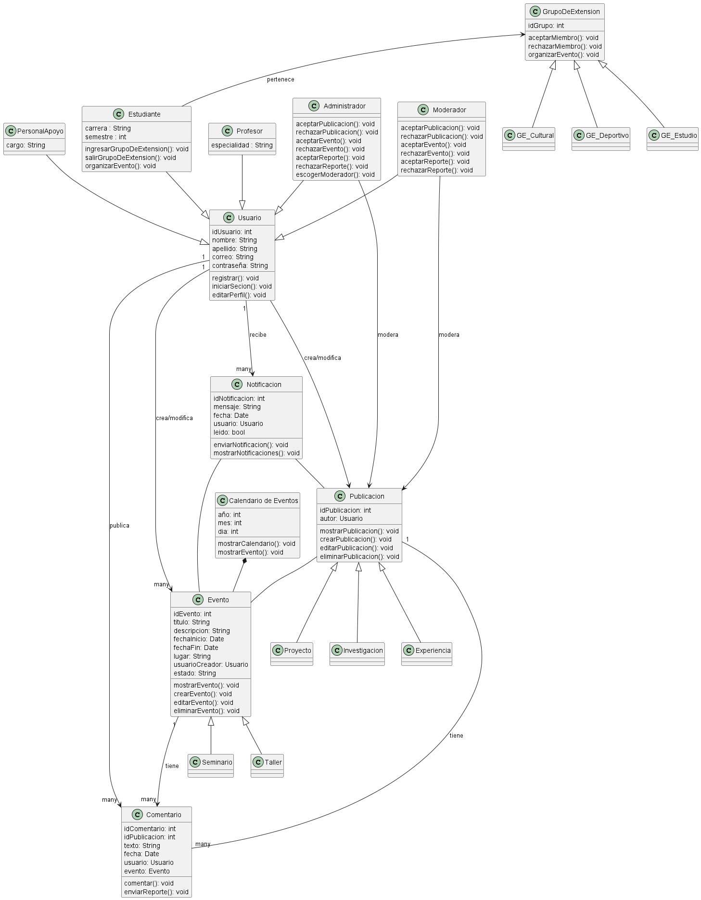
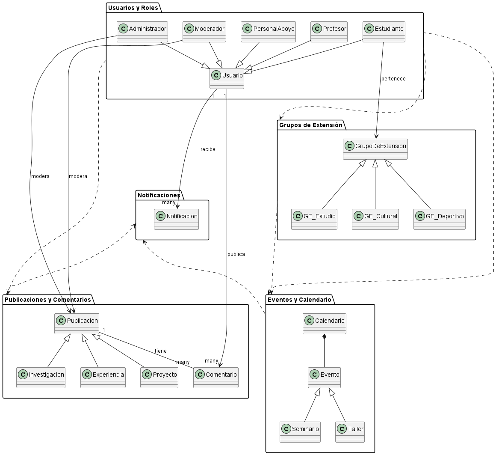
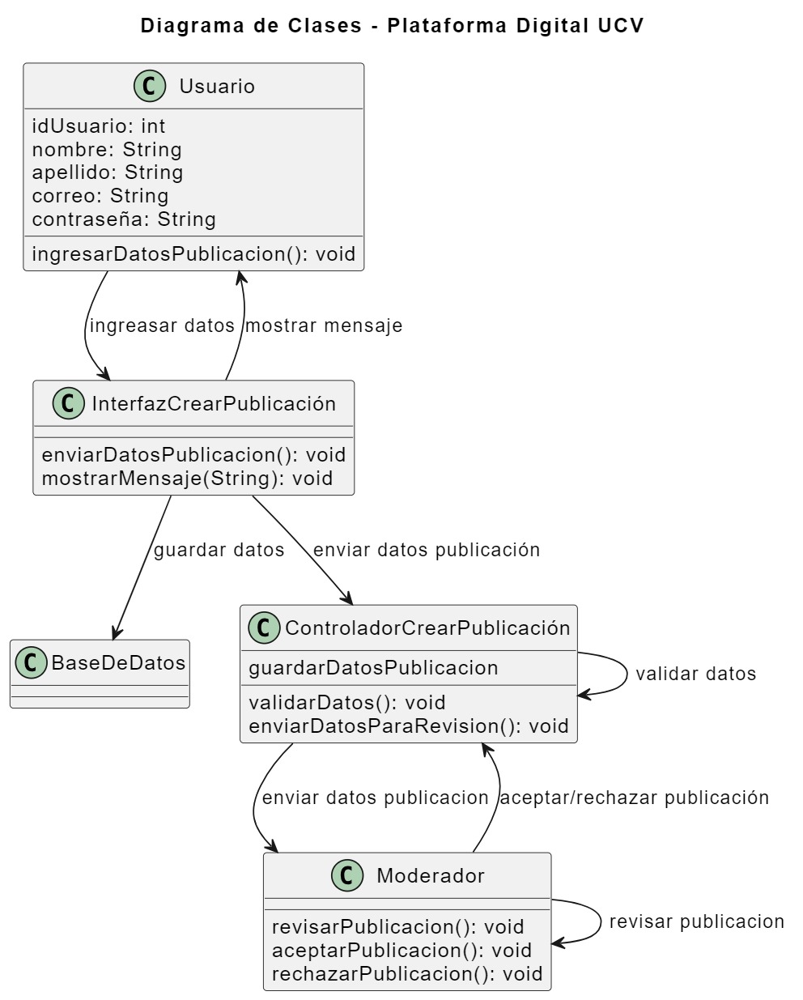
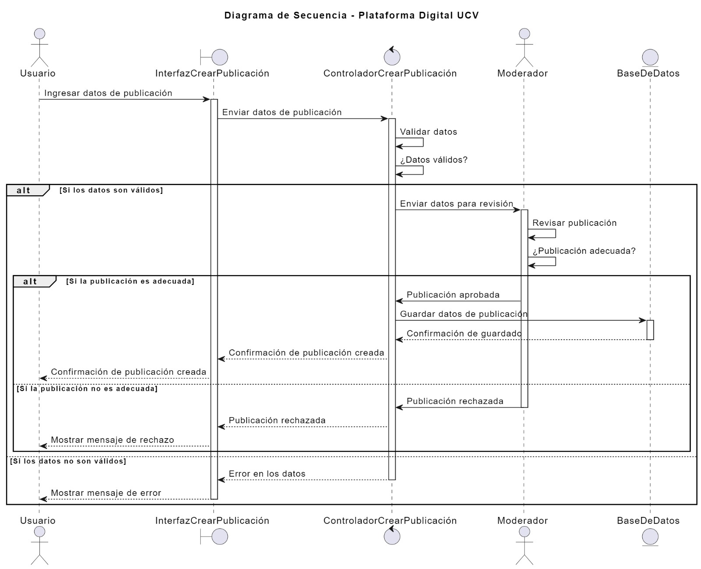
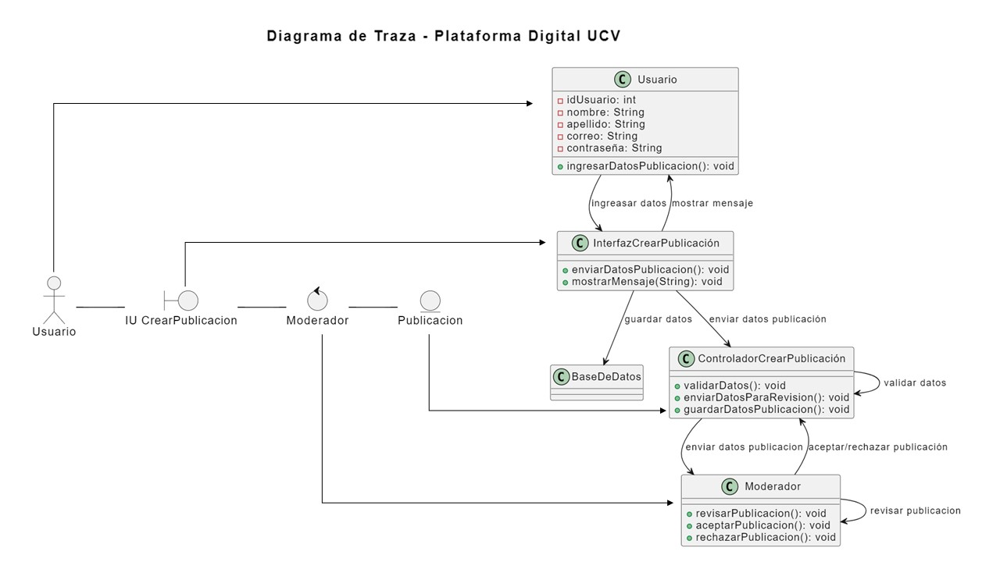
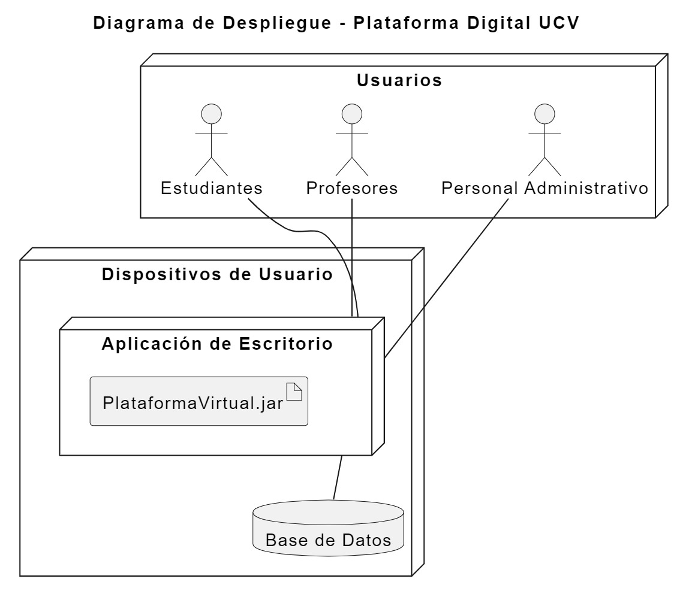

<h1 align="center" style="font-weight: bold; display:flex; justify-content:space-between; text-align:center; align-items:center">
  

  Proyecto Ingeniería de Software
  

  
</h1>

<section>
<h2 align="center">Miembros del Equipo</h2>

El **Equipo de Trabajo** está conformado por:

- Oscar Allen.
- Abigail Araujo.
- Javier Hernández.
- Alejandro Marín.
- Rolando Uzcátegui.
</section>

<section>
  <h2 align="center" style="text-">Modelo de Dominio</h2>
  

    <h4 style="text-decoration:underline">Diagrama de Clases</h4>
    
  

  

    <h4 style="text-decoration:underline">Diagrama de Estado</h4>
    
  

  

    <h4 style="text-decoration:underline"> Esquema de Pantallas</h4>
    
    
    
    
    
    
    
    
    
    
    
    
    
  

</section>
<section>
  <h2 align="center" style="text-">Modelo de Análisis</h2>
  

    <h4 style="text-decoration:underline">
    Diagrama de Clases
    </h4>
    
  

  

    <h4 style="text-decoration:underline">
      Diagrama de Colaboración de los Casos de Uso
    </h4>
    
  

  

    <h4 style="text-decoration:underline">
    Diagrama de Análisis de los Casos de Uso
    </h4>
    
  

  

    <h4 style="text-decoration:underline">
    Diagrama de Paquete de Análisis Final
    </h4>
    
  

</section>
<section>
  <h2 align="center" style="text-">Modelo de Diseño</h2>
  

    <h4 style="text-decoration:underline">
    Diagrama de Clases UC7
    </h4>
    
  

  

    <h4 style="text-decoration:underline">
      Diagrama de Secuencia UC7
    </h4>
    
  

    

    <h4 style="text-decoration:underline">
      Diagrama de Trazas UC7
    </h4>
    
  

</section>
<section>
  <h2 align="center" style="text-">Modelo de Despliegue</h2>
  

    <h4 style="text-decoration:underline">
    Diagrama de Despliegue
    </h4>
    
  

</section>
